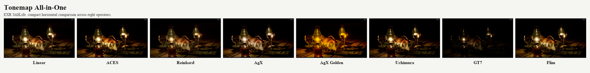
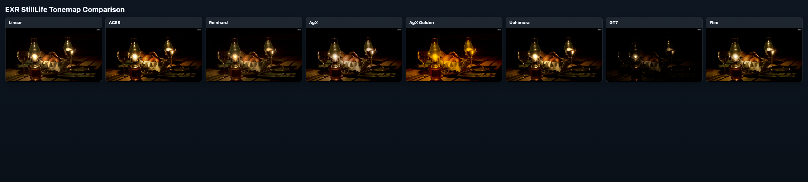
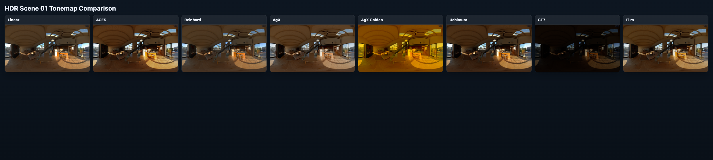

# Tonemap All-in-One

[English](README.md) | 简体中文

`Tonemap All-in-One` 是一个以 **交互演示** 为核心的 tone mapping 工程。

当前主仓库重点是：

1. 运行并对比多种 tonemap 算子（A/B 对比、分屏）。
2. 用统一输入链路验证 HDR/EXR/LDR 场景。
3. 通过最小 WebGL2 实现快速嵌入博客。

## Visual Preview



README 头图使用 `EXR StillLife` 的紧凑水平拼图，保留两组场景的高分辨率条带对比图：

1. `EXR StillLife`
2. `HDR Scene 01`

对比算子固定为：

1. `Linear`
2. `ACES`
3. `Reinhard`
4. `AgX`
5. `AgX Golden`
6. `Uchimura`
7. `GT7`
8. `Flim`

`EXR StillLife` 的单算法高清素材保留在 `docs/assets/readme/exr-stilllife-*.png`。

### EXR StillLife



### HDR Scene 01



## Demo（主入口）

- 路径：`demo/webgl-linear-baseline`
- 技术栈：Vite + TypeScript + 原生 WebGL2
- 主要能力：
  - 输入源切换：程序化图案 / HDR / EXR / 本地上传图片
  - 视图诊断：sRGB 预览 / false color / luminance heatmap / channel inspect
  - 算子切换：ACES、AgX 系列、Reinhard、Uchimura、Hejl、GT7、Tony、Flim、AMD LPM
  - A/B 对比：Split AB + 独立参数

### 本地运行

```bash
cd demo/webgl-linear-baseline
npm install
npm run dev
```

### 构建与测试

```bash
npm run test
npm run build
npm run build:pages
```


## References（保留）

算法来源、论文、快照和索引保留在：

- 索引：`references/tonemap-all-in-one/INDEX.md`
- 快照目录：`references/tonemap-all-in-one/snapshots`
- 算法映射：`references/tonemap-all-in-one/algorithms`

## 项目治理（轻量）

- 愿景：`management/PROJECT_VISION.md`
- 进度：`management/PROGRESS.md`
