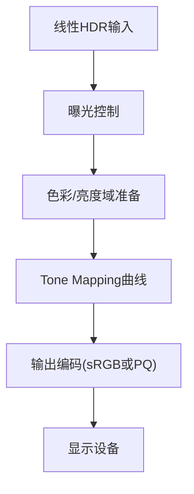

# 01. 为什么需要 Tone Mapping

## 1. 问题背景

真实世界亮度范围远高于常规显示设备可表达范围。

- 场景侧（scene-referred）可能覆盖 `10^-4` 到 `10^4` 甚至更高亮度层级。
- 显示侧（display-referred）通常受限于 SDR 或特定 HDR 标准。

直接把线性 HDR 值写到屏幕会导致：

1. 高光硬裁剪。
2. 中间调对比度异常。
3. 色彩关系失真。

## 2. Tone Mapping 的本质

Tone Mapping 是“感知友好”的动态范围重分配，不是单纯 clamp。

- 它需要在高光压缩、暗部保真、色相稳定之间权衡。
- 它常与曝光控制、色域变换、输出编码一起构成完整链路。

## 3. 从输入到输出的最小逻辑

## 4. 教程目标

- 建立统一比较框架：同一输入、同一曝光、可切换算法。
- 拆解算法核心流程，避免“只会抄公式”。
- 将每个算法映射到可维护的 WebGL 模块。
