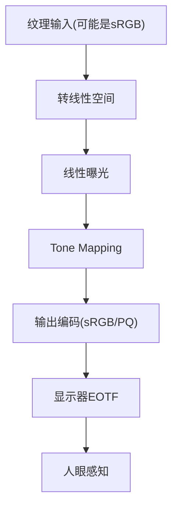

# 02. 颜色空间与显示链路基础

## 1. 关键概念

- `scene-referred`：描述场景光能关系的线性数据。
- `display-referred`：面向具体显示设备的输出信号。
- `OETF/EOTF`：编码与解码传递函数。
- `gamut`：色域范围，如 Rec.709、Rec.2020。

## 2. 常见工程误区

1. 把非线性输入当线性做 tonemap。
2. 在错误的颜色空间里压曲线。
3. 输出阶段重复或遗漏 gamma/OETF。

## 3. 最小显示链路

## 4. 本教程默认约定

- 渲染与 tonemap 均在线性域执行。
- 输出默认目标为 sRGB 预览（后续章节再扩展 PQ/HLG）。
- 算法比较时，固定曝光参数，避免混入自动曝光影响。
