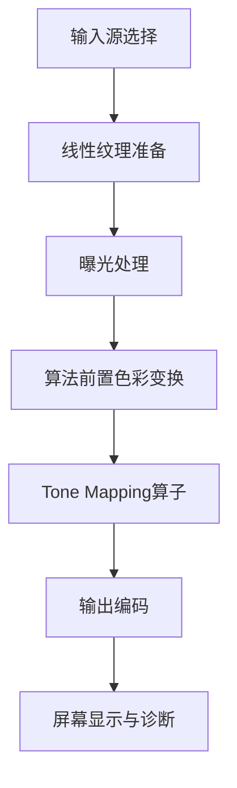

# 03. 全局工程流水线总览

## 1. 目标

建立“可比较、可扩展、可回归”的统一流水线，供 ACES/AgX/Reinhard/Tony/Flim/Uchimura/Hejl/GT7/LPM 共用。

## 2. 统一模块

1. 输入模块：程序化图案 + HDR 贴图加载。
2. 参数模块：曝光、算法选择、诊断视图。
3. Shader 模块：统一接口 `applyTonemap()`。
4. 输出模块：sRGB 预览与调试可视化。

## 3. 全局数据流

## 4. 与当前工程的连接点

- 基线代码：[`demo/webgl-linear-baseline/src`](../../demo/webgl-linear-baseline/src)
- 文档参考索引：[`references/tonemap-all-in-one`](../../references/tonemap-all-in-one)
- 后续迭代路线：[`90-implementation-roadmap.md`](./90-implementation-roadmap.md)
