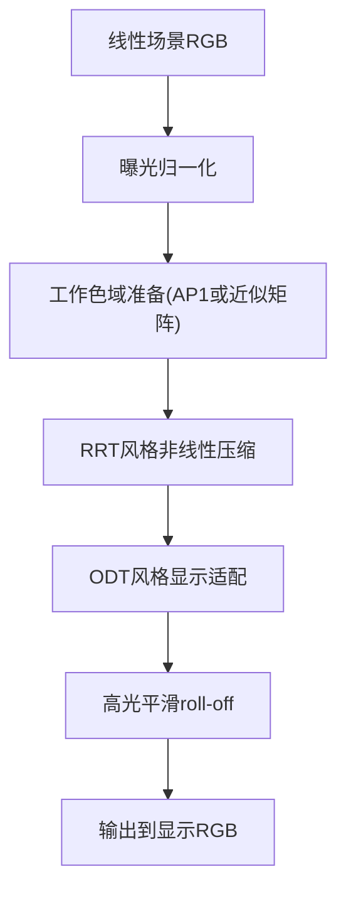
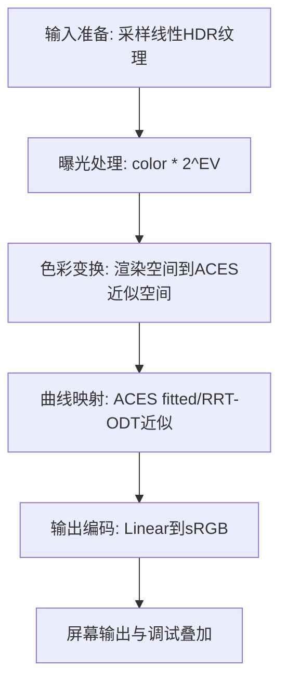

# 10. ACES

## 问题定义

ACES 关注的是在较宽动态范围下，获得电影风格的高光 roll-off 和稳定的整体色彩观感，减少简单曲线压缩带来的塑料感与高光断层。

## 输入输出

- 输入：线性场景 RGB（通常先映射到 ACES 工作空间，或使用 fit 版本在渲染空间近似）。
- 输出：显示参考 RGB（常见是近似 ACES RRT+ODT 后再输出到 sRGB 显示）。

## 核心流程图



## 实现流程图



## 伪代码骨架

```text
color = sampleLinearHDR(uv)
color = applyExposure(color, ev)
acesColor = toACESLikeWorkingSpace(color)
mapped = acesFitted(acesColor)
outColor = encodeToSRGB(mapped)
return outColor
```

## 参考映射

- 章节索引：[`references/tonemap-all-in-one/algorithms/aces.md`](../../references/tonemap-all-in-one/algorithms/aces.md)
- 本地快照：[`references/tonemap-all-in-one/snapshots/aces.glsl`](../../references/tonemap-all-in-one/snapshots/aces.glsl)
- 本地快照：[`references/tonemap-all-in-one/snapshots/aces-dev-README.md`](../../references/tonemap-all-in-one/snapshots/aces-dev-README.md)
