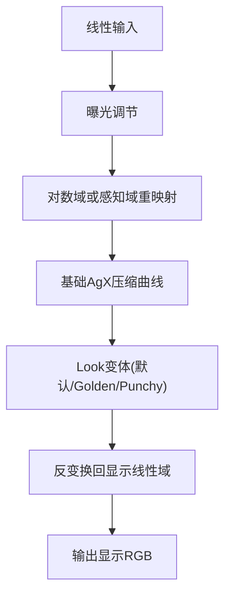
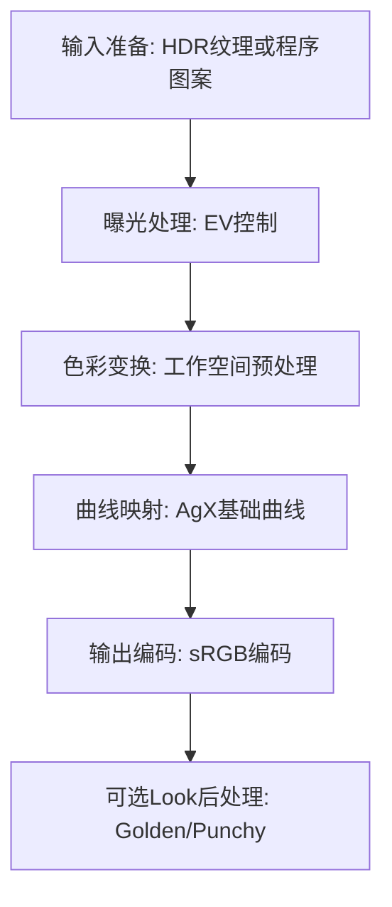

# 11. AgX 与变体

## 问题定义

AgX 的重点是保持中间调层次与颜色稳定，同时在高光部分形成更自然的压缩过渡；变体（如 Golden、Punchy）在此基础上通过 look 调整风格。

## 输入输出

- 输入：线性场景 RGB（通常在渲染工作空间中处理）。
- 输出：display-referred RGB（基础 AgX 或带 look 变体后的输出）。

## 核心流程图



## 实现流程图



## 伪代码骨架

```text
color = sampleLinearHDR(uv)
color = applyExposure(color, ev)
prepared = agxInputTransform(color)
mapped = agxBaseCurve(prepared)
looked = applyAgxLook(mapped, lookPreset)
outColor = encodeToSRGB(agxOutputTransform(looked))
return outColor
```

## 参考映射

- 章节索引：[`references/tonemap-all-in-one/algorithms/agx.md`](../../references/tonemap-all-in-one/algorithms/agx.md)
- 章节索引：[`references/tonemap-all-in-one/algorithms/agx-variants.md`](../../references/tonemap-all-in-one/algorithms/agx-variants.md)
- 本地快照：[`references/tonemap-all-in-one/snapshots/agx.glsl`](../../references/tonemap-all-in-one/snapshots/agx.glsl)
- 本地快照：[`references/tonemap-all-in-one/snapshots/threejs_tonemapping_pars_fragment.glsl.js`](../../references/tonemap-all-in-one/snapshots/threejs_tonemapping_pars_fragment.glsl.js)
- 本地快照：[`references/tonemap-all-in-one/snapshots/bevy_tonemapping_shared.wgsl`](../../references/tonemap-all-in-one/snapshots/bevy_tonemapping_shared.wgsl)
