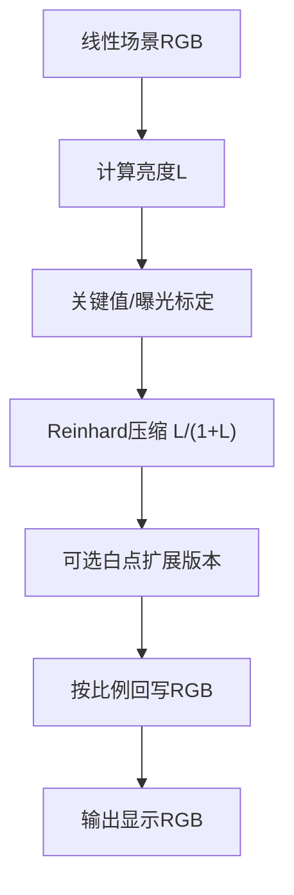
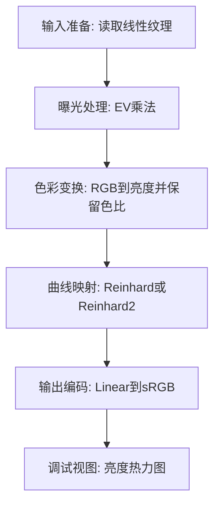

# 12. Reinhard（Reinhard et al.）

## 问题定义

Reinhard 是经典全局 tone mapping 算子，目标是在低复杂度下完成动态范围压缩，并保持整体亮度关系的连续性。

## 输入输出

- 输入：线性场景 RGB，或由线性 RGB 计算得到的亮度 `L`。
- 输出：压缩后的显示线性 RGB，再编码到 sRGB。

## 核心流程图



## 实现流程图



## 伪代码骨架

```text
color = sampleLinearHDR(uv)
color = applyExposure(color, ev)
L = dot(color, lumaWeights)
Ld = reinhard(L, whitePoint)
mapped = color * (Ld / max(L, eps))
outColor = encodeToSRGB(mapped)
return outColor
```

## 参考映射

- 章节索引：[`references/tonemap-all-in-one/algorithms/reinhard.md`](../../references/tonemap-all-in-one/algorithms/reinhard.md)
- 本地快照：[`references/tonemap-all-in-one/snapshots/reinhard-tonemap-2002.pdf`](../../references/tonemap-all-in-one/snapshots/reinhard-tonemap-2002.pdf)
- 本地快照：[`references/tonemap-all-in-one/snapshots/reinhard.glsl`](../../references/tonemap-all-in-one/snapshots/reinhard.glsl)
