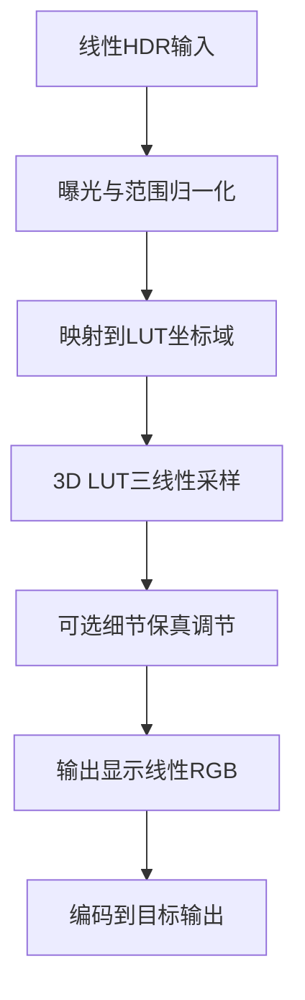
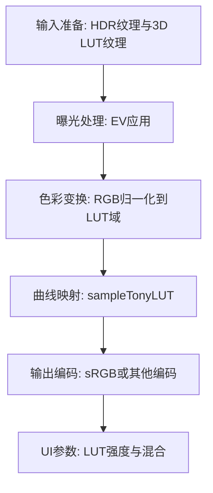

# 13. Tony McMapface（Tomasz Stachowiak）

## 问题定义

Tony McMapface 的核心思想是将复杂 tone mapping 行为烘焙到 3D LUT，通过查表方式在运行时获得稳定且艺术可控的映射结果。

## 输入输出

- 输入：线性场景 RGB（通常需要归一化到 LUT 采样域）。
- 输出：LUT 映射后的显示线性 RGB，再编码输出。

## 核心流程图



## 实现流程图



## 伪代码骨架

```text
color = sampleLinearHDR(uv)
color = applyExposure(color, ev)
lutUVW = toTonyLUTCoords(color)
mapped = sample3DLUT(tonyLut, lutUVW)
outColor = encodeToSRGB(mapped)
return outColor
```

## 参考映射

- 章节索引：[`references/tonemap-all-in-one/algorithms/tony-mc-mapface.md`](../../references/tonemap-all-in-one/algorithms/tony-mc-mapface.md)
- 本地快照：[`references/tonemap-all-in-one/snapshots/tony-mc-mapface-README.md`](../../references/tonemap-all-in-one/snapshots/tony-mc-mapface-README.md)
- 本地快照：[`references/tonemap-all-in-one/snapshots/tony_mc_mapface.hlsl`](../../references/tonemap-all-in-one/snapshots/tony_mc_mapface.hlsl)
