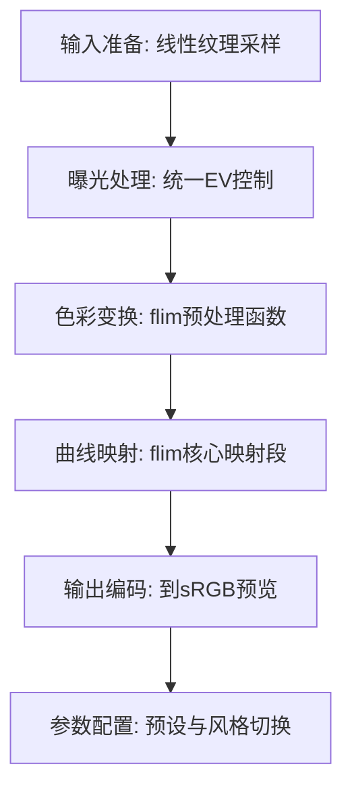

# 14. Flim by Bean

## 问题定义

Flim 是面向胶片风格模拟的变换链，强调观感风格塑造与颜色压缩协同，不仅是单一曲线，而是一组联动步骤。

## 输入输出

- 输入：线性场景 RGB（通常假设在一致工作色域中）。
- 输出：film-style display RGB，可用于后续输出编码。

## 核心流程图


## 实现流程图



## 伪代码骨架

```text
color = sampleLinearHDR(uv)
color = applyExposure(color, ev)
prepared = flimPreTransform(color, preset)
mapped = flimMainCurve(prepared, preset)
styled = flimPostAdjust(mapped, preset)
outColor = encodeToSRGB(styled)
return outColor
```

## 参考映射

- 章节索引：[`references/tonemap-all-in-one/algorithms/flim-by-bean.md`](../../references/tonemap-all-in-one/algorithms/flim-by-bean.md)
- 本地快照：[`references/tonemap-all-in-one/snapshots/flim-README.md`](../../references/tonemap-all-in-one/snapshots/flim-README.md)
- 本地快照：[`references/tonemap-all-in-one/snapshots/flim.py`](../../references/tonemap-all-in-one/snapshots/flim.py)
- 本地快照：[`references/tonemap-all-in-one/snapshots/flim-main.py`](../../references/tonemap-all-in-one/snapshots/flim-main.py)
