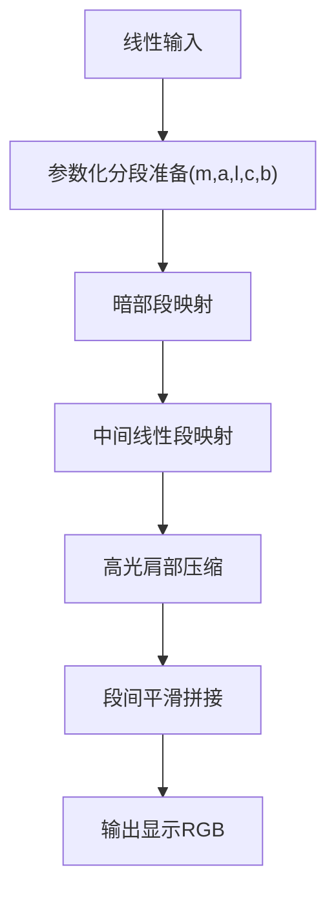
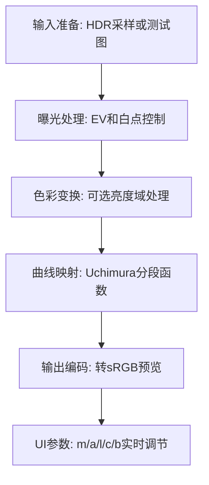

# 15. Uchimura / Gran Turismo

## 问题定义

Uchimura（常称 Gran Turismo 曲线）强调可控参数下的高光肩部、线性中段与暗部过渡，适合实时渲染中做可调且稳定的视觉风格控制。

## 输入输出

- 输入：线性场景 RGB（曝光后的工作域数据）。
- 输出：经过分段/平滑函数压缩后的显示线性 RGB。

## 核心流程图



## 实现流程图



## 伪代码骨架

```text
color = sampleLinearHDR(uv)
color = applyExposure(color, ev)
params = buildUchimuraParams(m, a, l, c, b)
mapped = uchimuraCurve(color, params)
outColor = encodeToSRGB(mapped)
return outColor
```

## 参考映射

- 章节索引：[`references/tonemap-all-in-one/algorithms/gran-turismo-uchimura.md`](../../references/tonemap-all-in-one/algorithms/gran-turismo-uchimura.md)
- 本地快照：[`references/tonemap-all-in-one/snapshots/uchimura.glsl`](../../references/tonemap-all-in-one/snapshots/uchimura.glsl)
- 本地快照：[`references/tonemap-all-in-one/snapshots/uchimura_hdr_theory_and_practice_slideshare.html`](../../references/tonemap-all-in-one/snapshots/uchimura_hdr_theory_and_practice_slideshare.html)
