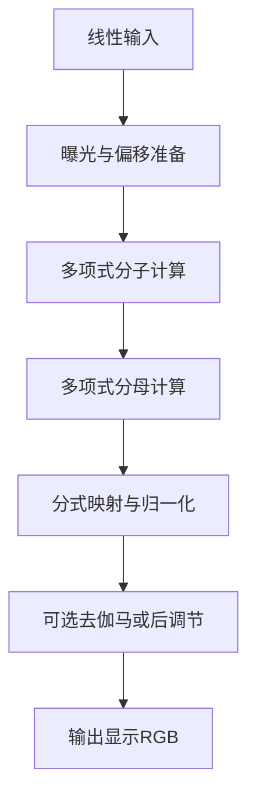
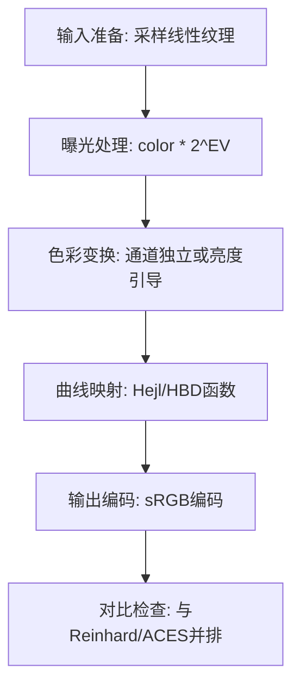

# 16. Hejl（Jim Hejl / HBD）

## 问题定义

Hejl-Burgess-Dawson 公式是实时渲染中常见的轻量 filmic 近似，目标是在极低成本下获得比线性裁剪更自然的高光压缩与整体对比关系。

## 输入输出

- 输入：线性场景 RGB（通常带曝光预乘）。
- 输出：filmic 风格压缩后的显示线性 RGB。

## 核心流程图



## 实现流程图



## 伪代码骨架

```text
color = sampleLinearHDR(uv)
color = applyExposure(color, ev)
mapped = hejlBurgessDawson(color)
outColor = encodeToSRGB(mapped)
return outColor
```

## 参考映射

- 章节索引：[`references/tonemap-all-in-one/algorithms/hejl.md`](../../references/tonemap-all-in-one/algorithms/hejl.md)
- 本地快照：[`references/tonemap-all-in-one/snapshots/filmicworlds-tonemapping-operators.html`](../../references/tonemap-all-in-one/snapshots/filmicworlds-tonemapping-operators.html)
- 本地快照：[`references/tonemap-all-in-one/snapshots/filmic-hable.glsl`](../../references/tonemap-all-in-one/snapshots/filmic-hable.glsl)
