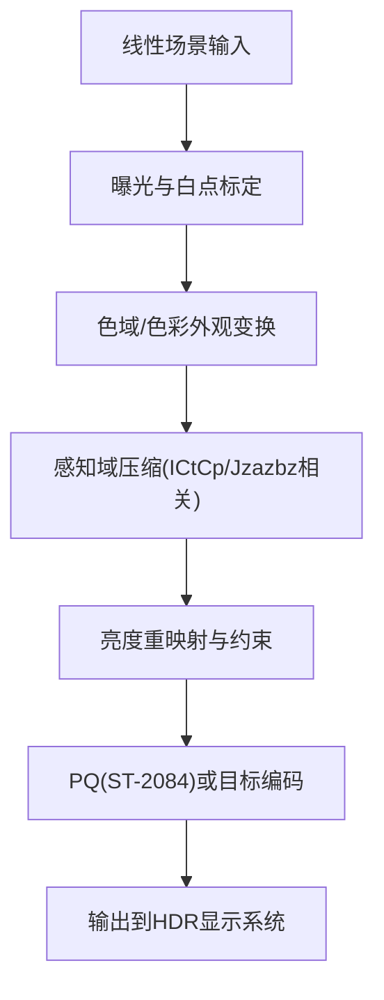
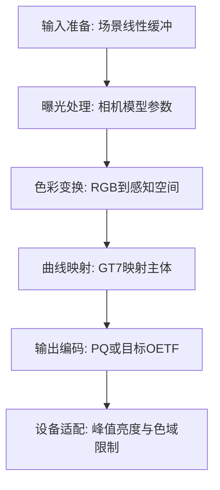

# 17. GT7（Gran Turismo 7）

## 问题定义

GT7 路线强调“物理一致 + 感知一致”的完整显示链路，涉及色域、感知空间、PQ 编码等多步骤协同，不是单一曲线函数。

## 输入输出

- 输入：场景线性 RGB（可包含宽色域与高动态范围信息）。
- 输出：针对目标显示系统（含 HDR 路径）的编码信号。

## 核心流程图



## 实现流程图



## 伪代码骨架

```text
color = sampleLinearHDR(uv)
color = applyExposure(color, cameraParams)
perceptual = toPerceptualSpace(color)
mapped = gt7ToneMap(perceptual, displayTarget)
encoded = encodePQorTarget(mapped, displayTarget)
return encoded
```

## 参考映射

- 章节索引：[`references/tonemap-all-in-one/algorithms/gt7.md`](../../references/tonemap-all-in-one/algorithms/gt7.md)
- 本地快照：[`references/tonemap-all-in-one/snapshots/gt7_tone_mapping.cpp`](../../references/tonemap-all-in-one/snapshots/gt7_tone_mapping.cpp)
- 本地快照：[`references/tonemap-all-in-one/snapshots/gt7_pbs_slides_v1.1.pdf`](../../references/tonemap-all-in-one/snapshots/gt7_pbs_slides_v1.1.pdf)
