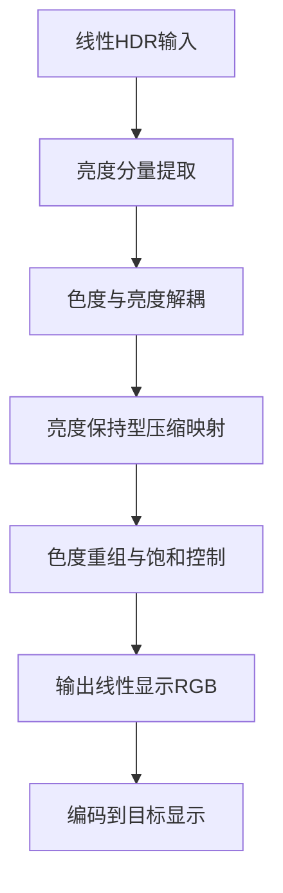
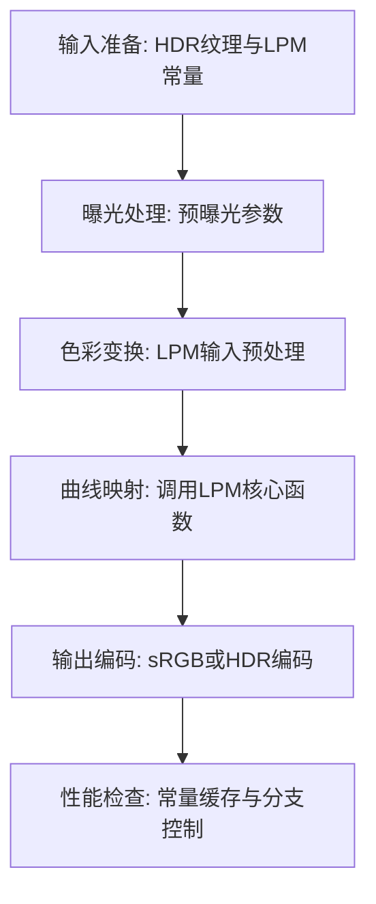

# 18. AMD LPM（Luma Preserving Mapper）

## 问题定义

AMD LPM 旨在在高动态范围压缩过程中尽量保持亮度感知一致性与颜色稳定，适合实时图形管线中做高性能映射。

## 输入输出

- 输入：线性 HDR RGB（可结合预曝光与色域信息）。
- 输出：LPM 处理后的显示线性 RGB，随后做目标输出编码。

## 核心流程图



## 实现流程图



## 伪代码骨架

```text
color = sampleLinearHDR(uv)
color = applyExposure(color, ev)
lpmInput = lpmPrepare(color, constants)
mapped = lpmMap(lpmInput, constants)
outColor = encodeToDisplay(mapped, target)
return outColor
```

## 参考映射

- 章节索引：[`references/tonemap-all-in-one/algorithms/amd-lpm.md`](../../references/tonemap-all-in-one/algorithms/amd-lpm.md)
- 本地快照：[`references/tonemap-all-in-one/snapshots/ffx_lpm.h`](../../references/tonemap-all-in-one/snapshots/ffx_lpm.h)
- 本地快照：[`references/tonemap-all-in-one/snapshots/LPMPS.glsl`](../../references/tonemap-all-in-one/snapshots/LPMPS.glsl)
- 本地快照：[`references/tonemap-all-in-one/snapshots/fidelityfx-lpm-readme.md`](../../references/tonemap-all-in-one/snapshots/fidelityfx-lpm-readme.md)
- 本地快照：[`references/tonemap-all-in-one/snapshots/LPM_doc.pdf`](../../references/tonemap-all-in-one/snapshots/LPM_doc.pdf)
